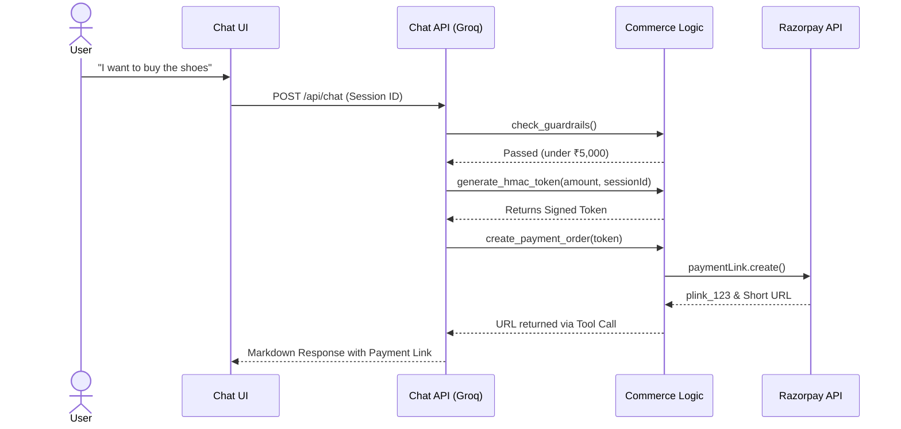

# OMNI.AI 🛒🤖

<div align="center">
  <p><strong>A next-generation, agentic e-commerce checkout experience built to demonstrate how Large Language Models (LLMs) can be safely integrated into high-stakes financial flows.</strong></p>
  
   
   
  
</div>

---

Rather than relying purely on prompt engineering, OMNI.AI uses **deterministic runtime guardrails** and **cryptographic token verification** to ensure that the AI cannot be tricked into offering fake discounts, bypassing spend limits, or hallucinating payment approvals.

## 📑 Table of Contents
1. [✨ Key Features](#-key-features)
2. [🏗️ System Architecture](#-system-architecture)
3. [🚀 Getting Started](#-getting-started)
4. [📂 Codebase Guide](#-codebase-guide)
5. [🗺️ Future Roadmap](#️-future-roadmap)

---

## ✨ Key Features

### 🛡️ Ironclad Security & Deterministic Guardrails
- **No Hallucinated Deals**: The LLM is strictly prohibited from inventing discounts, promos, or "buy X get Y free" offers. Prices are pulled directly from the source of truth (`catalog.json`) and enforced server-side.
- **Spend Cap Enforcement**: A hard-coded ₹5,000 spend limit is enforced *outside* the LLM's control. Prompt injection attempts are mathematically blocked by the backend.
- **Two-Step HMAC Checkout Flow**: To prevent the AI from falsely claiming an order is approved, the agent must first obtain a cryptographically signed HMAC token bound strictly to the active `sessionId`. Only with this token can it generate a payment link.

### 💳 Real-World Payments (Razorpay)
- **Native Payment Links**: Integrates directly with Razorpay's Payment Links API, generating legitimate, clickable `rzp.io` URLs directly within the chat interface.
- **Asynchronous Webhook Recovery**: Listens for `payment.captured` and `payment.failed` webhooks in the background. Using Razorpay's `notes` metadata, it securely traces asynchronous webhook events back to the original chat session.
- **Silent State Rollback**: If a user's card declines, the webhook silently rolls back the session state, allowing the user to securely retry without losing their context.

### 📈 Merchant Insights & SEO
- **Unmet Demand Logging**: Whenever a customer asks for a product not in the catalog, the agent honestly informs them and silently logs the intent to a `/merchant-insights` dashboard to help merchants identify lost revenue.
- **Dynamic JSON-LD Endpoint**: The entire catalog is automatically mapped via a `src/app/api/catalog/json-ld/route.ts` endpoint in valid Schema.org Product format for seamless SEO indexing.

### 🛠️ Developer Experience
- **Live Audit Trail**: A toggleable sliding side-panel reveals the exact system prompts, tool calls, and backend verification steps the LLM is making in real-time.

---

## 🏗️ System Architecture

OMNI.AI uses a strict tool-calling loop where the LLM proposes actions, but the Node.js backend dictates the reality of the state.



---

## 🚀 Getting Started

### Prerequisites
- **Node.js** 18+
- A **Razorpay** Test Account
- **Groq** API Key

### Installation

1. **Clone the repository** and install dependencies:
   ```bash
   npm install
   ```

2. **Configure Environment Variables**:
   Create a `.env.local` file in the root directory:
   ```env
   GROQ_API_KEY=your_groq_api_key
   RAZORPAY_KEY_ID=your_razorpay_key_id
   RAZORPAY_KEY_SECRET=your_razorpay_key_secret
   RAZORPAY_WEBHOOK_SECRET=your_custom_webhook_secret
   ```

3. **Start the Development Server**:
   ```bash
   npm run dev
   ```

4. **Set Up Webhooks (Local Testing)**:
   Use `ngrok` to expose your local server to the internet:
   ```bash
   ngrok http 3000
   ```
   Add your ngrok URL (`https://<your-ngrok-url>/api/webhooks/razorpay`) to the Razorpay Dashboard Webhook settings, subscribing to `payment.captured` and `payment.failed`.

---

## 📂 Codebase Guide

| Path | Purpose |
| :--- | :--- |
| `src/app/api/chat/route.ts` | The core orchestration loop. Connects Groq LLM to backend tools and manages the multi-turn conversational state. |
| `src/lib/commerce.ts` | The deterministic brain. Houses all cart logic, HMAC cryptographic verification, and direct Razorpay API calls. |
| `src/app/api/webhooks/razorpay/route.ts` | Listens for async payment events, securely verifying webhook signatures and mapping them back to active user sessions. |
| `catalog.json` | The flat-file source of truth for all inventory, pricing, and product IDs. |
| `src/app/merchant-insights/page.tsx` | Internal dashboard that surfaces logged unmet demand for business intelligence. |

---

## 🗺️ Future Roadmap

To scale OMNI.AI to millions of users, the following architectural upgrades are planned:
- [ ] **Vector Search Engine**: Replace `catalog.json` with Pinecone or Algolia for ultra-fast, semantic, typo-tolerant product retrieval.
- [ ] **Persistent State**: Migrate `sessionStore` to **Redis** and `orderStatusStore` to **PostgreSQL** to survive server restarts and scale horizontally across multiple instances.
- [ ] **Concurrency Locking**: Implement a 15-minute Redis inventory reservation lock during the checkout phase to prevent overselling highly demanded items.
- [ ] **Generative UI (React Server Components)**: Stream interactive React components (carousels, live carts) directly into the chat interface rather than relying entirely on Markdown text.

---
<div align="center">
  <i>Built to prove that Agentic UI and E-commerce can be both deeply conversational and mathematically secure.</i>
</div>
