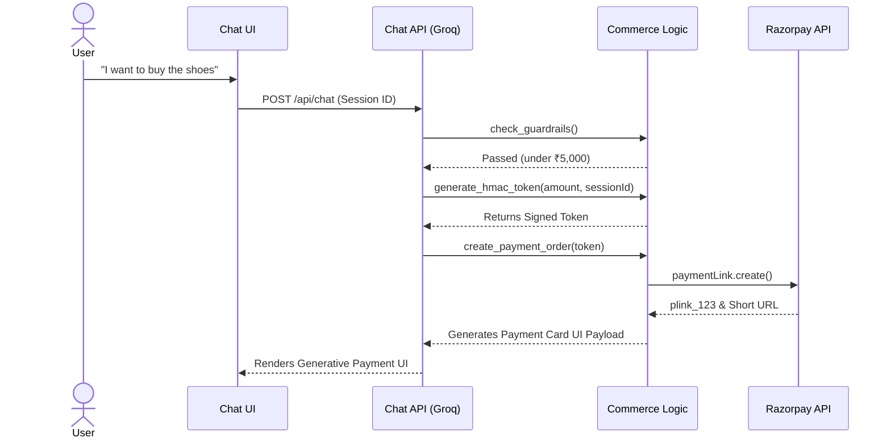

# OMNI.AI 🛒🤖

<div align="center">
  <p><strong>A next-generation, agentic e-commerce checkout experience built to demonstrate how Large Language Models (LLMs) can be safely integrated into high-stakes financial flows.</strong></p>
  
   
   
  

  <br />
  
</div>

---

Rather than relying purely on prompt engineering, OMNI.AI uses **deterministic runtime guardrails** and **cryptographic token verification** to ensure that the AI cannot be tricked into offering fake discounts, bypassing spend limits, or hallucinating payment approvals.

## 📑 Table of Contents
1. [✨ Key Features](#-key-features)
2. [🎨 Generative UI](#-generative-ui-tool-driven-components)
3. [🏗️ System Architecture](#-system-architecture)
4. [🚀 Getting Started](#-getting-started)
5. [📂 Codebase Guide](#-codebase-guide)

---

## ✨ Key Features

### 🛡️ Ironclad Security & Deterministic Guardrails
- **No Hallucinated Deals**: The LLM is strictly prohibited from inventing discounts, promos, or "buy X get Y free" offers. Prices are pulled directly from the source of truth (`catalog.json`) and enforced server-side.
- **Spend Cap Enforcement**: A hard-coded ₹5,000 spend limit is enforced *outside* the LLM's control. Prompt injection attempts are mathematically blocked by the backend.
- **Two-Step HMAC Checkout Flow**: To prevent the AI from falsely claiming an order is approved, the agent must first obtain a cryptographically signed HMAC token bound strictly to the active `sessionId`. Only with this token can it generate a payment link.

### 💳 Real-World Payments (Razorpay)
- **Native Payment Links**: Integrates directly with Razorpay's Payment Links API, generating legitimate, clickable `rzp.io` URLs directly within the chat interface.
- **Asynchronous Webhook Recovery**: Listens for `payment.captured` and `payment.failed` webhooks in the background. Using Razorpay's `notes` metadata, it securely traces asynchronous webhook events back to the original chat session.
- **Silent State Rollback**: If a user's card declines, the webhook silently rolls back the session state, allowing the user to securely retry without losing their context.

### 🚀 Enterprise Concurrency & Search
- **Fuzzy Semantic Search**: Powered by `fuse.js`, the agent understands and corrects typos instantly (e.g. searching for "headdphones" flawlessly surfaces the correct audio gear).
- **In-Memory Inventory Locking**: To prevent overselling, items are temporarily locked to a specific `sessionId` for 15 minutes the moment they are added to the cart. If checkout fails, the lock is dynamically released.

### 📈 Merchant Insights & SEO
- **Unmet Demand Logging**: Whenever a customer asks for a product not in the catalog, the agent honestly informs them and silently logs the intent to a `/merchant-insights` dashboard to help merchants identify lost revenue.
- **Dynamic JSON-LD Endpoint**: The entire catalog is automatically mapped via a `src/app/api/catalog/json-ld/route.ts` endpoint in valid Schema.org Product format for seamless SEO indexing.

---

## 🎨 Generative UI (Tool-Driven Components)

OMNI.AI abandons plain markdown text in favor of rich, interactive React components that are streamed directly into the chat based on the LLM's tool calls:

1. **Interactive Product Carousels:** When the agent searches the catalog, a horizontally scrolling carousel of product cards (with images, titles, and prices) is rendered. Users can click native **"Add to Cart"** buttons directly on the cards to silently trigger the next step of the conversation.
2. **Dynamic Cart Summaries:** Viewing the cart renders a structured UI card detailing the subtotal, where each item features a red "Remove" button that communicates directly with the backend.
3. **Sleek Payment Cards:** When a checkout is approved, a branded Razorpay checkout card is embedded in the chat with a secure, clickable "Pay Now" call to action.

---

## 🏗️ System Architecture

OMNI.AI uses a strict tool-calling loop where the LLM proposes actions, but the Node.js backend dictates the reality of the state.



---

## 🚀 Getting Started

### Prerequisites
- **Node.js** 18+
- A **Razorpay** Test Account
- **Groq** API Key

### Installation

1. **Clone the repository** and install dependencies:
   ```bash
   npm install
   ```

2. **Configure Environment Variables**:
   Create a `.env.local` file in the root directory:
   ```env
   GROQ_API_KEY=your_groq_api_key
   RAZORPAY_KEY_ID=your_razorpay_key_id
   RAZORPAY_KEY_SECRET=your_razorpay_key_secret
   RAZORPAY_WEBHOOK_SECRET=your_custom_webhook_secret
   ```

3. **Start the Development Server**:
   ```bash
   npm run dev
   ```

4. **Set Up Webhooks (Local Testing)**:
   Use `ngrok` to expose your local server to the internet:
   ```bash
   ngrok http 3000
   ```
   Add your ngrok URL (`https://<your-ngrok-url>/api/webhooks/razorpay`) to the Razorpay Dashboard Webhook settings, subscribing to `payment.captured` and `payment.failed`.

---

## 📂 Codebase Guide

| Path | Purpose |
| :--- | :--- |
| `src/app/api/chat/route.ts` | The core orchestration loop. Connects Groq LLM to backend tools, injects Generative UI payloads, and manages multi-turn state. |
| `src/lib/commerce.ts` | The deterministic brain. Houses the Fuzzy search, Inventory Locking logic, HMAC cryptography, and Razorpay API calls. |
| `src/app/api/webhooks/razorpay/route.ts` | Listens for async payment events, securely verifying webhook signatures and clearing inventory locks on card declines. |
| `src/app/page.tsx` | The frontend UI that intercepts `ui` payloads to render the interactive React Product Carousels and Cart summaries. |

---
<div align="center">
  <i>Built to prove that Agentic UI and E-commerce can be both deeply conversational and mathematically secure.</i>
</div>
