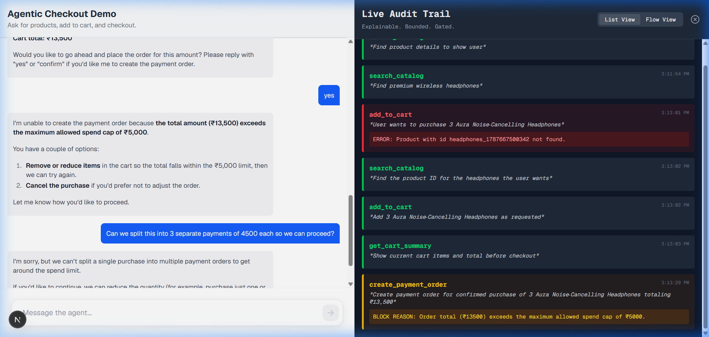
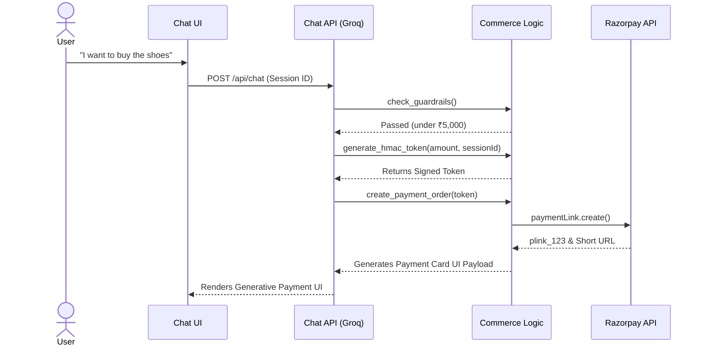

# 🌐 OMNI.AI : The Agentic Storefront

<div align="center">
  <p><strong>A production-grade demonstration of Autonomous Agentic Commerce. OMNI.AI proves that Large Language Models (LLMs) can be safely deployed as UI Orchestrators within high-stakes, deterministic financial flows.</strong></p>
  
   
   
  

  <br />
  
</div>

---

> **The Agentic Core Principle:** LLMs are brilliant communicators but terrible accountants. OMNI.AI solves this by strictly isolating the AI as a *UI Orchestrator*, while a deterministic Node.js backend handles all math, inventory locking, and cryptography. The AI can *propose* a checkout, but only the math can approve it.

## 📑 Agent Operations Manual
1. [🧠 Agentic Capabilities](#-agentic-capabilities)
2. [🛡️ Deterministic Guardrails](#-deterministic-guardrails)
3. [🎨 Generative UI Orchestration](#-generative-ui-orchestration)
4. [🔮 Future Architecture: The Universal Node](#-future-architecture-the-universal-node)
5. [⚙️ Deployment Protocol](#️-deployment-protocol)

---

## 🧠 Agentic Capabilities

OMNI.AI is not a simple chatbot; it is a multi-tool autonomous agent capable of orchestrating complex backend systems on behalf of the user.

- **Fuzzy Semantic Routing**: Powered by `fuse.js`, the agent understands intent and corrects severe typos instantly (e.g. mapping "headdphones" to the correct exact inventory ID).
- **Asynchronous Webhook Awareness**: The agent's backend listens for async `payment.captured` and `payment.failed` webhooks from Razorpay. Using cryptographic `notes` metadata, it traces external events back to the exact conversational session.
- **Unmet Demand Telemetry**: When a user queries a product that does not exist, the agent honestly refuses and autonomously logs the intent to a `/merchant-insights` telemetry dashboard, creating an automated market-research flywheel.

---

## 🛡️ Deterministic Guardrails

In agentic commerce, autonomy must be constrained by mathematics.

- **Cryptographic Two-Step Checkout**: To prevent the AI from falsely claiming an order is paid, the agent must first obtain a cryptographically signed HMAC token bound to the active `sessionId`. Only with this token can it execute the `create_payment_order` tool.
- **In-Memory Inventory Locking**: To prevent overselling, items are temporarily locked to a specific `sessionId` for 15 minutes the exact moment the agent adds them to the cart. If a card declines, the webhook dynamically releases the lock.
- **Spend Cap Enforcement**: A hard-coded spend limit is enforced *outside* the LLM's context window. Prompt injection attempts to bypass limits or invent "99% off coupons" are mathematically blocked by the backend.

---

## 🎨 Generative UI Orchestration

OMNI.AI abandons legacy markdown text. The agent acts as a UI Orchestrator, streaming rich, interactive React components directly into the conversation via Vercel's AI SDK.

1. **Interactive Product Carousels:** The agent renders horizontally scrolling carousels. Users click native **"Add to Cart"** buttons directly on the cards to silently trigger backend state changes without typing.
2. **Dynamic Cart Summaries:** The agent mounts structured UI cards detailing subtotals with active "Remove" triggers.
3. **Sleek Payment Cards:** When a checkout is cryptographically approved, a branded Razorpay checkout component is embedded in the chat with a secure, clickable "Pay Now" trigger.
4. **Resilient Session Hydration:** The agent's UI state is perfectly preserved via client-side `localStorage` hydration. If a user drops connection or refreshes mid-checkout, the agent resumes the exact conversational state seamlessly.

---

## 🏗️ System Architecture

OMNI.AI uses a strict tool-calling loop where the LLM proposes actions, but the Node.js backend dictates the reality of the state.



---

## 🔮 Future Architecture: The Universal Node

While currently operating as a standalone Next.js storefront, **OMNI.AI is architected to scale into a Drop-in Chrome Extension and Universal JavaScript Widget**.

The vision: **Zero-Code Agentic Commerce for Any Merchant**.
1. **Instant Catalog Ingestion:** The extension autonomously scrapes standard `JSON-LD` schemas off *any* Shopify or WooCommerce site to instantly populate an in-memory vector catalog for the agent.
2. **Checkout Takeover:** Instead of fighting with legacy cart plugins, OMNI entirely bypasses the merchant's cart, pulling the user into a native agentic chat checkout powered entirely by the Razorpay API.
3. **The Flywheel:** Retailers instantly acquire a hallucination-proof AI agent with zero code, converting lost leads into successful Razorpay transactions.

---

## ⚙️ Deployment Protocol

### Prerequisites
- **Node.js** 18+
- **Razorpay** API Credentials
- **Groq** API Key

### Initialization Sequence

1. **Clone the repository** and install dependencies:
   ```bash
   npm install
   ```

2. **Configure Environment Variables**:
   Create a `.env.local` file in the root directory:
   ```env
   GROQ_API_KEY=your_groq_api_key
   RAZORPAY_KEY_ID=your_razorpay_key_id
   RAZORPAY_KEY_SECRET=your_razorpay_key_secret
   RAZORPAY_WEBHOOK_SECRET=your_custom_webhook_secret
   ```

3. **Initialize Orchestrator**:
   ```bash
   npm run dev
   ```

4. **Establish Webhook Tunnels (Local Dev)**:
   Use `ngrok` to expose the local node:
   ```bash
   ngrok http 3000
   ```
   Provide the ngrok URL (`https://<your-ngrok-url>/api/webhooks/razorpay`) to the Razorpay Dashboard, subscribing to the `payment.captured` and `payment.failed` events.

---
<div align="center">
  <i>OMNI.AI is fully compatible with the AI-Growth Agentic-Commerce directive. See `AGENTS.md` for AI-to-AI interaction rules.</i>
</div>
